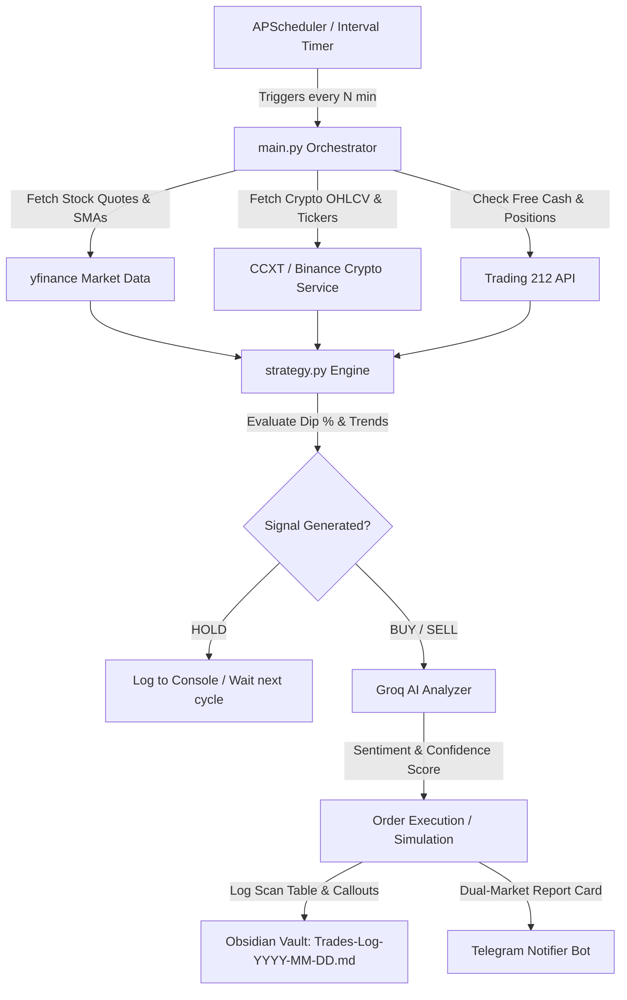

# 🤖 Automated Stock & Crypto Trading, AI Sentiment & Obsidian Journaling Bot

An autonomous Python trading bot integrating **Dual-Market Scanning** for both **Stocks** (yfinance / S&P 500 / NASDAQ 100 / Trading 212) and **Cryptocurrencies** (CCXT / Binance public API), **Groq Cloud AI** (`llama-3.3-70b-versatile` / `llama-3.1-8b-instant`) for trade sentiment and thesis analysis, **Trading 212 REST API** (HTTP Basic Auth) for stock execution, **Telegram Bot** for unified dual-market alerts, and **Obsidian Local REST API** for daily markdown trade journaling.

---

## 📑 Table of Contents
- [Architecture Overview](#-architecture-overview)
- [Project Structure](#-project-structure)
- [Prerequisites & Credentials Setup](#-prerequisites--credentials-setup)
  - [1. Trading 212 API Credentials](#1-trading-212-api-credentials)
  - [2. Groq Cloud AI](#2-groq-cloud-ai)
  - [3. Telegram Bot Notifications](#3-telegram-bot-notifications)
  - [4. Obsidian Local REST API Plugin](#4-obsidian-local-rest-api-plugin)
  - [5. Market Data (Stocks & Crypto)](#5-market-data-stocks--crypto)
- [Installation & Setup](#-installation--setup)
- [Configuration Reference (.env)](#-configuration-reference-env)
- [Usage & Commands](#-usage--commands)
  - [Dual-Market Scanning (--target)](#dual-market-scanning---target)
  - [Dynamic Stock Market Scanner](#dynamic-stock-market-scanner)
  - [Diagnostic / Test Commands](#diagnostic--test-commands)
  - [Dry-Run Simulation](#dry-run-simulation)
  - [Autonomous Continuous Scheduling](#autonomous-continuous-scheduling)
- [Obsidian Trade Log Preview](#-obsidian-trade-log-preview)
- [Risk Disclaimer](#-risk-disclaimer)

---

## 🏛 Architecture Overview



---

## 📂 Project Structure

```
TBOT/
├── .env.example              # Environment variables template
├── .gitignore                # Git ignore rules
├── requirements.txt          # Python dependencies (yfinance, ccxt, pandas, requests, pydantic-settings, apscheduler)
├── config.py                 # Pydantic Settings & environment validation
├── strategy.py               # Custom strategy engine (SMA crossover / Dip threshold)
├── main.py                   # Main runner, scheduler, dual-market orchestrator, and CLI tools
├── README.md                 # Complete documentation and setup guide
├── tests/
│   └── test_components.py   # Unit tests (Auth, Scanner, Crypto, Groq AI, Telegram, Strategy, Obsidian)
└── services/
    ├── __init__.py           # Service package exports
    ├── market_data.py        # yfinance client, dynamic S&P 500 scanner & RateLimiter
    ├── crypto_data.py        # CCXT / Binance crypto market data & OHLCV SMA engine
    ├── trading212.py         # Trading 212 REST API wrapper (HTTP Basic Auth & instruments metadata)
    ├── ai_analyzer.py        # Groq Cloud AI sentiment & confidence engine
    ├── telegram_bot.py       # Telegram Bot alert dispatcher (dual-market cycle summary)
    └── obsidian.py           # Obsidian Local REST API integration (scan cycles & trade entries)
```

---

## 🔑 Prerequisites & Credentials Setup

### 1. Trading 212 API Credentials
1. Open the Trading 212 app or web portal.
2. Navigate to **Settings** -> **API (Beta)**.
3. Generate a new API key (and Secret Key if provided).
4. Set `T212_API_KEY` (and `T212_SECRET_KEY`) in `.env`.
5. Set `T212_ENVIRONMENT=demo` in `.env` to test with virtual funds before using `live`.

### 2. Groq Cloud AI
1. Sign up at [Groq Console](https://console.groq.com/).
2. Generate an API key and set `GROQ_API_KEY=gsk_...` in `.env`.
3. Supported active models:
   - `llama-3.3-70b-versatile` *(Recommended default, ultra-fast & intelligent)*
   - `llama-3.1-8b-instant`

### 3. Telegram Bot Notifications
1. Open Telegram and search for [@BotFather](https://t.me/BotFather).
2. Send `/newbot`, follow the prompts, and copy the **HTTP API Token** (`TELEGRAM_BOT_TOKEN`).
3. Send a message to your bot in Telegram or add it to a group.
4. Get your Chat ID using [@userinfobot](https://t.me/userinfobot) or via `https://api.telegram.org/bot<token>/getUpdates`.
5. Set `TELEGRAM_CHAT_ID` in `.env`.

### 4. Obsidian Local REST API Plugin
1. In Obsidian, open **Settings** -> **Community Plugins**.
2. Install and enable **Local REST API** by *coddingtonbear*.
3. In the plugin settings, copy the generated **API Key** and ensure the server is active (default port `27124`).
4. Set `OBSIDIAN_REST_API_KEY` in `.env`.

### 5. Market Data (Stocks & Crypto)
- **Stocks**: Uses `yfinance` without requiring paid keys. Includes automatic rate limiting (max 5 requests/sec).
- **Crypto**: Uses `ccxt` (Binance/KuCoin public client) or direct Binance REST API fallback. No API keys required for market scanning.

---

## 🚀 Installation & Setup

### Step 1: Create a Virtual Environment & Install Dependencies
```bash
python -m venv .venv
# Activate on Windows:
.venv\Scripts\activate
# Activate on macOS/Linux:
# source .venv/bin/activate

pip install -r requirements.txt
```

### Step 2: Configure Environment Variables
```bash
# Windows PowerShell
copy .env.example .env

# macOS / Linux
cp .env.example .env
```
Fill in your credentials in `.env`.

---

## 💻 Usage & Commands

### Dual-Market Scanning (`--target`)
Scan specific market sectors or evaluate both concurrently:
```bash
# 1. Evaluate BOTH Stocks and Crypto in dry-run mode (Default)
python main.py --target all --run-once --dry-run

# 2. Evaluate ONLY Cryptocurrencies (e.g. BTC, ETH, SOL, BNB, XRP, AVAX...)
python main.py --target crypto --run-once --dry-run

# 3. Evaluate ONLY Stocks (Watchlist or Dynamic S&P 500 scanner)
python main.py --target stocks --scan-market --scan-limit 50 --run-once --dry-run
```

### Diagnostic / Test Commands
```bash
# 1. Test Stock & Crypto market data fetching
python main.py --test-market

# 2. Test Groq AI model query & sentiment analysis
python main.py --test-ai

# 3. Test Telegram Bot alert dispatch
python main.py --test-telegram

# 4. Test Obsidian connection and create a sample journal entry
python main.py --test-obsidian

# 5. Test Trading 212 credentials and print account balances
python main.py --test-t212
```

### Autonomous Scheduled Trading
```bash
# Continuous dual-market scheduled bot
python main.py --target all
```

---

## 📝 Obsidian Trade Log Preview

The bot creates or appends to `Trading-Logs/Trades-Log-YYYY-MM-DD.md` in your vault with:
- Frontmatter metadata and tags (`#trading-bot`, `#daily-trade-log`, `#stocks`, `#crypto`).
- Market scan cycle blocks with evaluated indicators and prices.
- Detailed callouts including Groq AI analysis sentiment, thesis, and confidence score:

```markdown
### 🔍 Market Evaluation Cycle: `01:10:00 UTC` (ALL | DRY-RUN SIMULATION)
> [!info] Cycle & Account Status
> - **Timestamp:** `2026-08-25 01:10:00 UTC`
> - **Target Market:** `all`
> - **Free Cash:** `$500.00` | **Invested:** `$500.00` | **Total Equity:** `$1,000.00`
> - **Unrealized PnL:** `+$25.00` | **Open Positions:** `2`
> - **Instruments Evaluated:** `60`

#### 📈 Evaluated Indicators & Decisions
| Ticker | Price | Short SMA | Long SMA | Dip % | Signal | Reason |
| :--- | :--- | :--- | :--- | :--- | :--- | :--- |
| **AAPL_US_EQ** | $180.00 | $186.00 | $182.50 | 3.23% | 🟢 BUY | Price dropped 3.2% below SMA |
| **BTC/USDT** | $60,250.00 | $61,500.00 | $59,800.00 | 2.03% | 🟢 BUY | Dip below 10-day SMA support |
```

---

## ⚠️ Risk Disclaimer
Trading equities and cryptocurrencies involves financial risk. Always test strategies thoroughly using the `DEMO` environment and `--dry-run` simulation mode before risking real capital.
